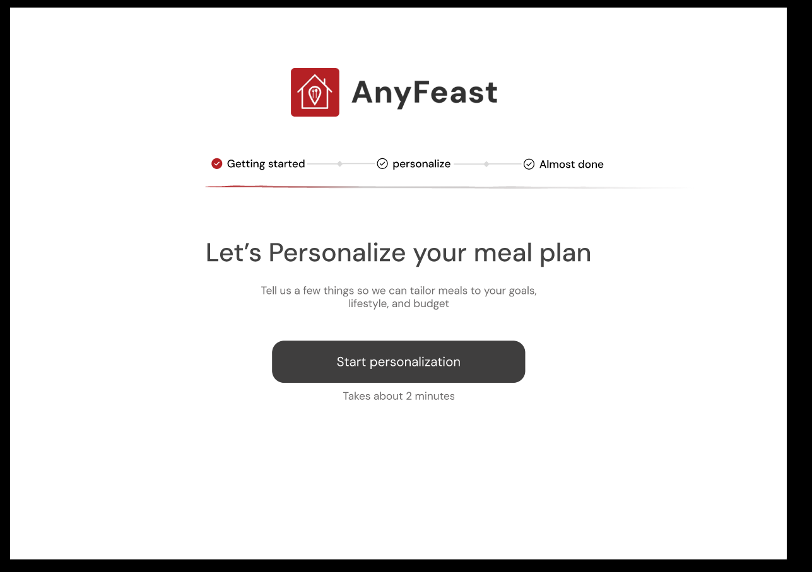
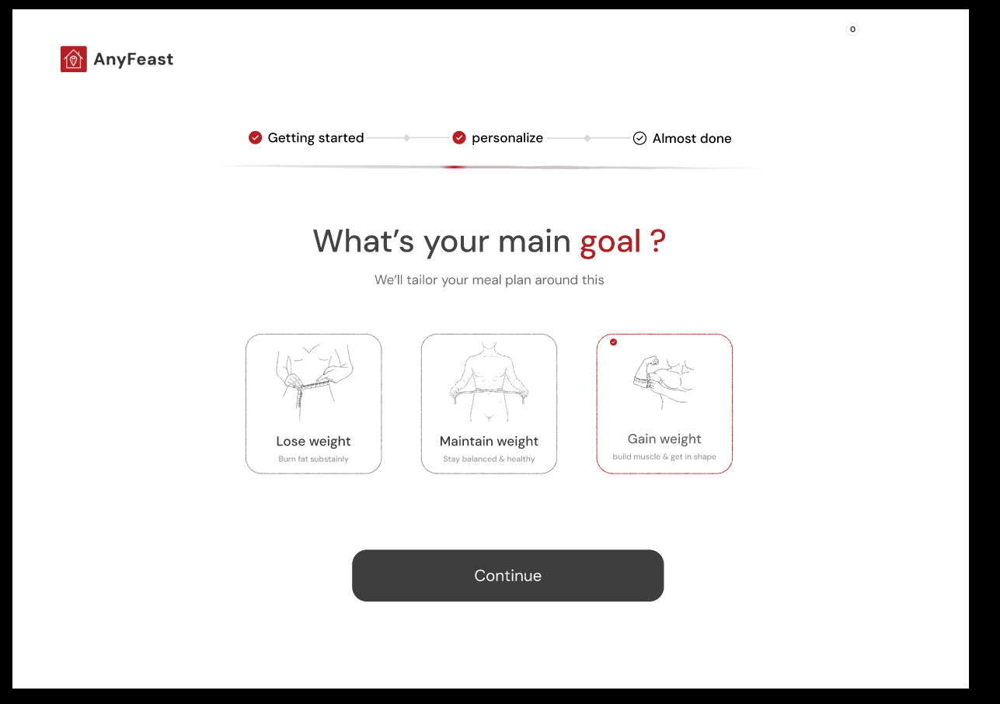
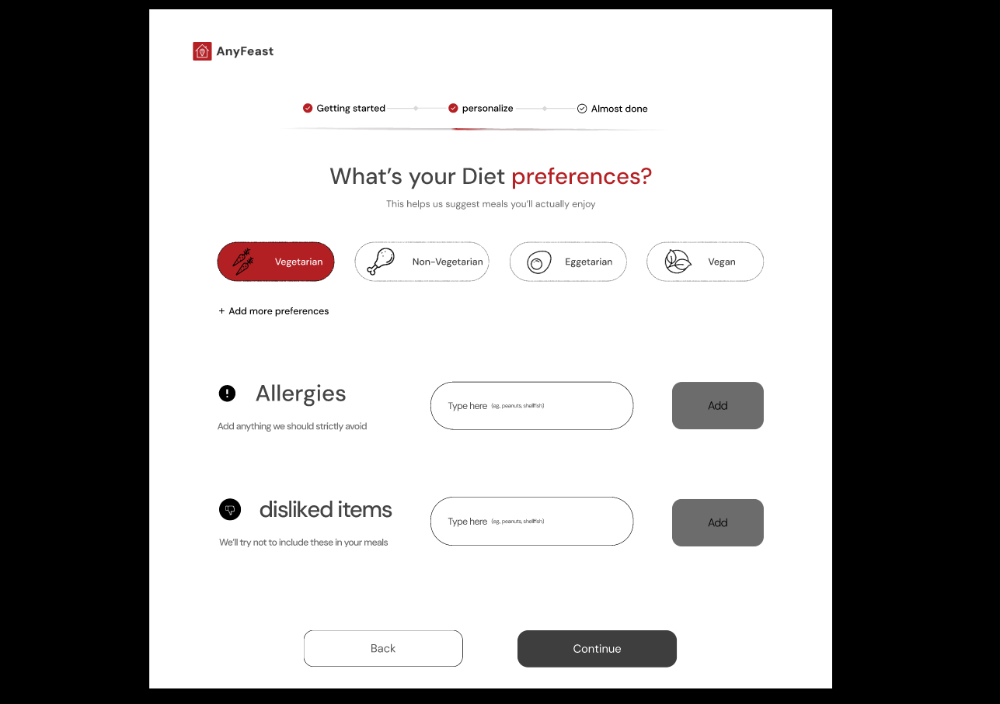
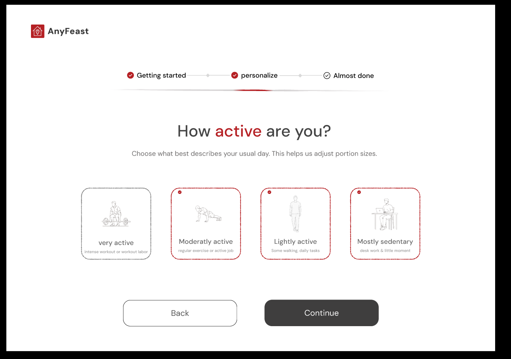
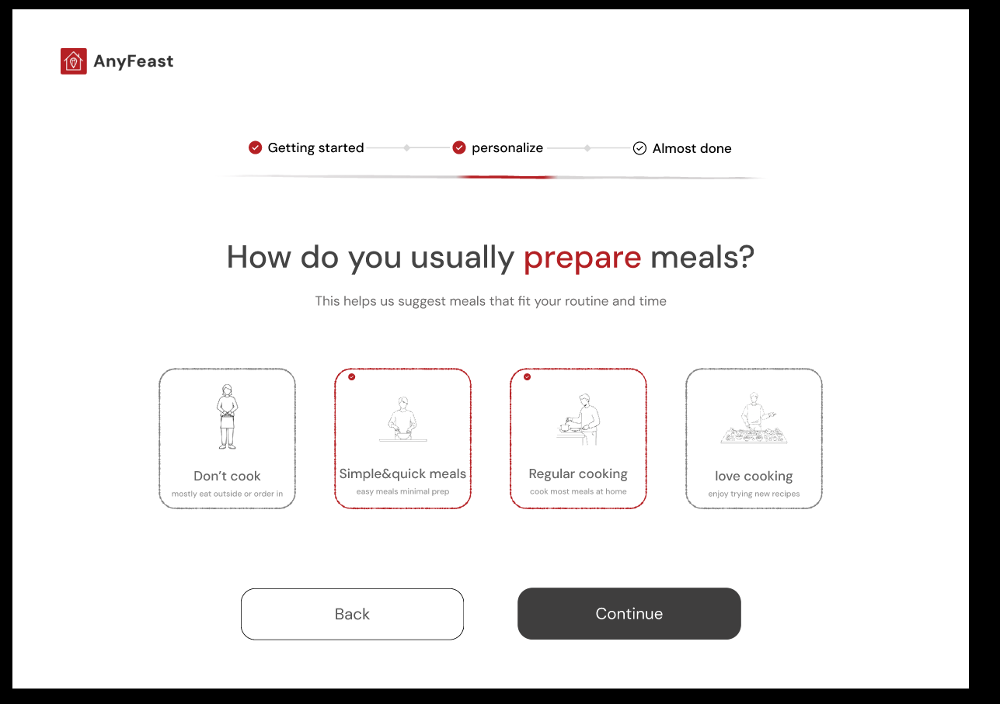
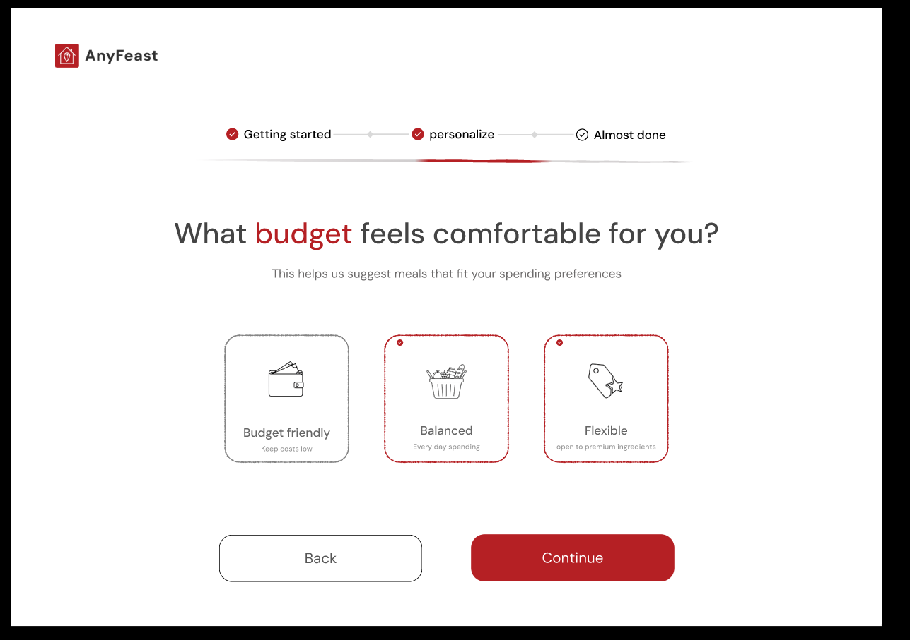
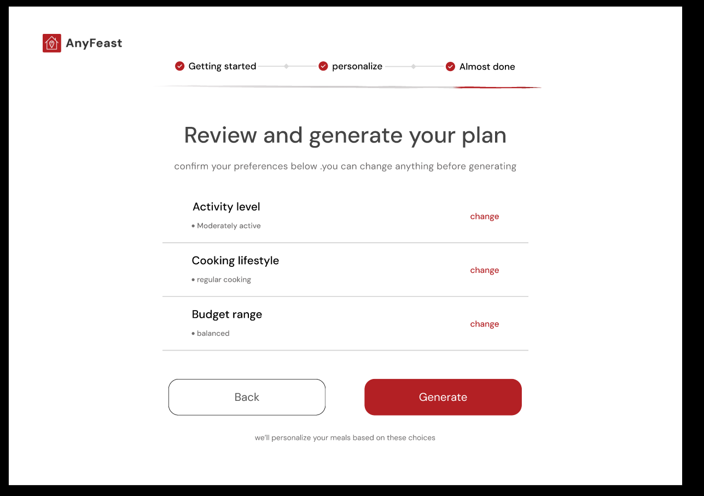
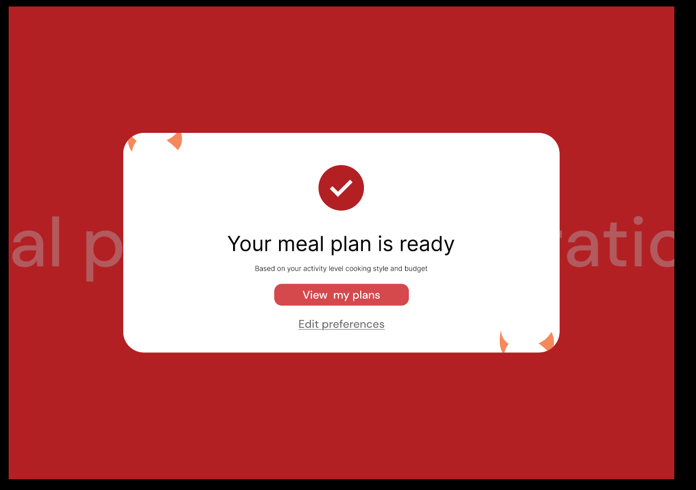

# Anyfeast — Personalization UI (Flutter)

This repository contains the Flutter (Material 3) UI implementation for the Anyfeast onboarding personalization flow.

## Structure
- `lib/`
  - `screens/` — individual screen widgets (welcome, goal, diet, activity, cooking, budget, review, success)
  - `widgets/` — reusable components (option card, pill, buttons, header, animated navigation)
  - `theme/` — `app_theme.dart` with colors and text styles
  - `main.dart` — app entry and routes
- `assets/screenshots/` — included UI screenshots

## Screenshots
Below are the onboarding screens included in this repository (click images to open full-size).

<p align="center">
  
  
</p>

<p align="center">
  
  
  
</p>

<p align="center">
  
  
</p>

<p align="center">
  
</p>

*Images are stored in `assets/screenshots/` and will display automatically on GitHub.*

## Running locally
1. Install Flutter (3.7+ recommended) and enable web support.
2. Run the app on web server:

   ```bash
   flutter run -d web-server --web-port=8080
   ```

3. Open: http://localhost:8080

